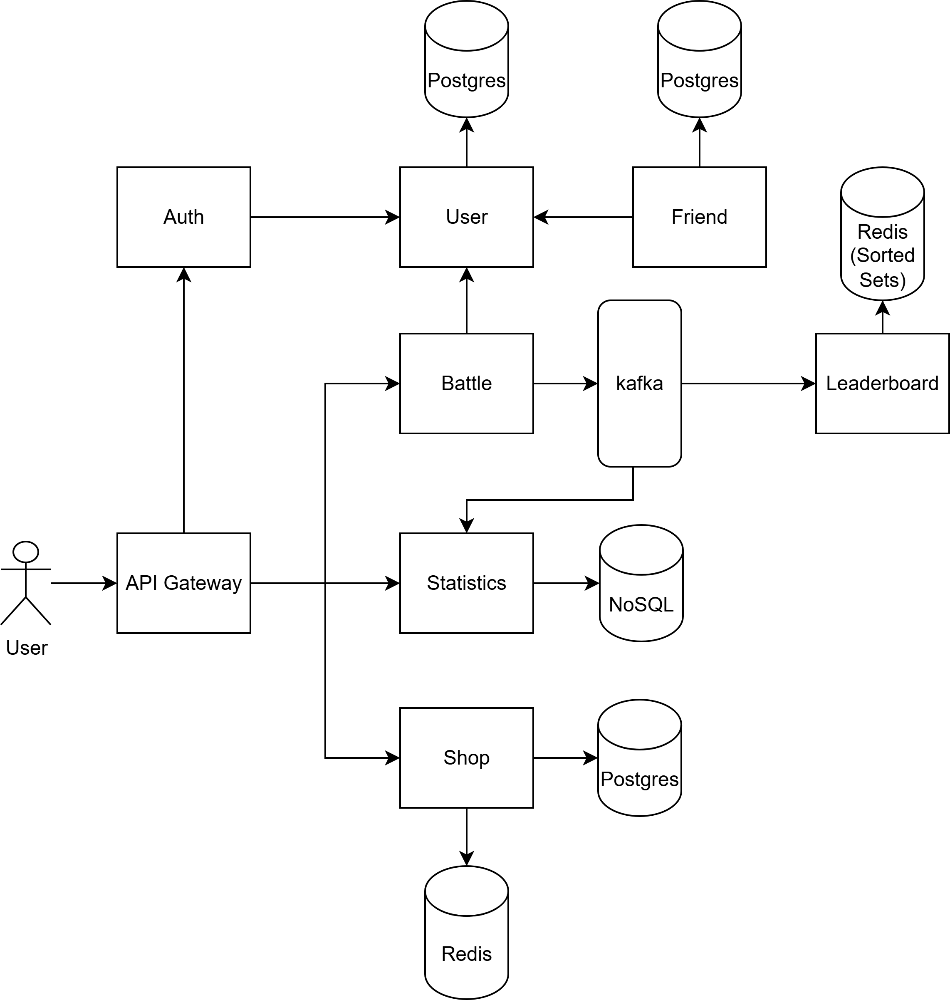

Application build on https://github.com/Latand/MedSyncWebApp
### First project initialization
1. Copy .env.dist to .env file, update BOT_TOKEN to your bot token from @botfather

## Telegram authentication

The browser does not choose or store the player identity. When opened as a
Telegram Mini App, it sends `Telegram.WebApp.initData` to the account service.
The account service verifies Telegram's HMAC signature with `BOT_TOKEN`, reads
the Telegram user ID from the verified payload, and returns a 15-minute access
token. The same `APP_AUTH_SECRET` must be available to the account and battle
services.

`APP_ENV` is the only mode switch. With `APP_ENV=development`, ordinary browser
clients receive separate local identities; use `?devUser=900000001` and
`?devUser=900000002` for deterministic multiplayer clients. With
`APP_ENV=production`, development identities are rejected and only verified
Telegram `initData` can create a session.

## Public API gateway

Nginx is the browser-facing BFF and the only service that publishes a host
port. Frontend, account, shop, battle, leaderboard, databases, Redis, and Kafka
are reachable only inside the Docker network.

The gateway uses a deny-by-default contract: every public path and HTTP method
is explicitly listed in `nginx/dev.conf` and `nginx/prod.conf`. Unknown API
routes return 404 and wrong methods return 405. In particular, clients cannot
call payment/refund APIs or submit battle and leaderboard results over HTTP.
Battle results are produced by the authoritative battle server and delivered
internally through Kafka.

When adding a browser API, add the smallest exact route to both Nginx configs
and keep authentication and object-level authorization in the owning service.
Do not expose a whole service prefix.

The release News service follows the same rule: the browser can only read
`GET /api/news`; release publication is an internal Docker-network endpoint
authenticated by `DEPLOY_ADMIN_TOKEN`. Its PostgreSQL data lives in the
separate `news-db-data` volume and is included in the pre-migration backup.
2. Copy frontend/.env.dist to frontend/.env file, update VITE_BACKEND_URL=http://localhost

## Dev and production contours

The default Compose project is the development contour:

```bash
docker compose up -d
# http://localhost
```

The production-like contour is isolated in its own Compose project named
`prod`. Its containers use the `prod-*` prefix while dev containers use the
`dev-*` prefix. It uses
different containers, networks, volumes, Postgres databases, Redis instances,
and a production frontend build. Nginx binds only to localhost on port 8081;
the Cloudflare Tunnel container forwards the public hostname to `nginx:8080`
without exposing another host port:

```bash
copy .env.prod.example .env.prod
# Fill every production value, including APP_AUTH_SECRET and the public hostname.
docker compose --profile cloudflare --env-file .env.prod -f docker-compose.prod.yml up -d --build
# https://your-cloudflare-hostname.example.com
```

For a local temporary Cloudflare Quick Tunnel, run the hardened stack without
the profile and start Cloudflare from the host:

```powershell
docker compose --env-file .env.prod -f docker-compose.prod.yml up -d --build
cloudflared tunnel --url http://localhost:8081
```

Quick Tunnel hostnames are temporary and cannot be chosen or guaranteed. To
keep a stable hostname, use a named Cloudflare Tunnel and set its token in
`CLOUDFLARE_TUNNEL_TOKEN`.

Only one polling process may use a Telegram bot token. The dev bot is disabled
by default; run it only when the production bot is stopped:

```bash
docker compose --profile dev-bot up -d bot
```

### Release and deployment flow

Releases are immutable SemVer tags. Patch versions advance automatically from
`v0.0.1`; set `RELEASE_MAJOR` or `RELEASE_MINOR` in the ignored
`deploy/release.env` when starting a new series:

```bash
copy deploy/release.env.example deploy/release.env
python deploy/release.py --dry-run
python deploy/release.py
```

The second command creates the commit/tag and deploys the production-like
stack locally at `http://127.0.0.1:8081`. To publish the tag for the remote
GitHub staging/production workflow instead, use `python deploy/release.py --push`;
it does not start the local stack.

The tag workflow builds only changed service images, preserves unchanged image
digests, deploys to protected staging first, and then production. The deployer
announces maintenance, drains active battles, creates database backups, runs
locked migrations, recreates only affected containers, verifies readiness, and
can restore the previous image manifest without deleting volumes. Configure
the host secrets and GitHub `staging`/`production` environments according to
the [production deploy runbook](docs/production-deploy-runbook.md).

### Up project
```bash
docker compose up
docker compose exec bot python -m alembic upgrade head
```

### Future architecture

